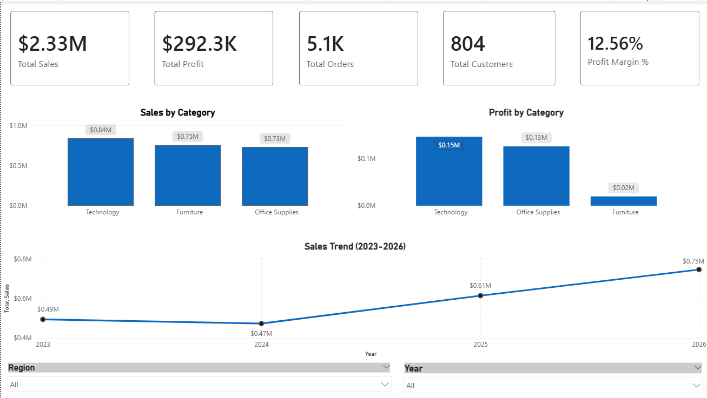
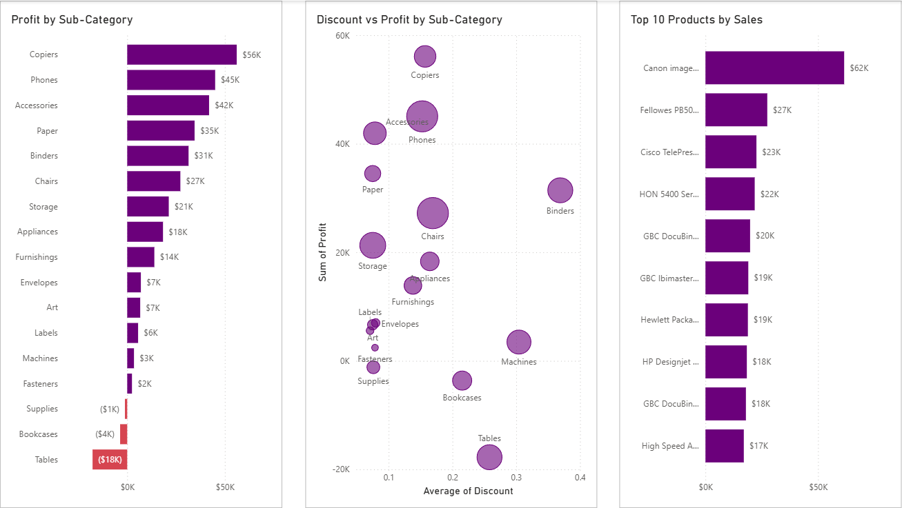
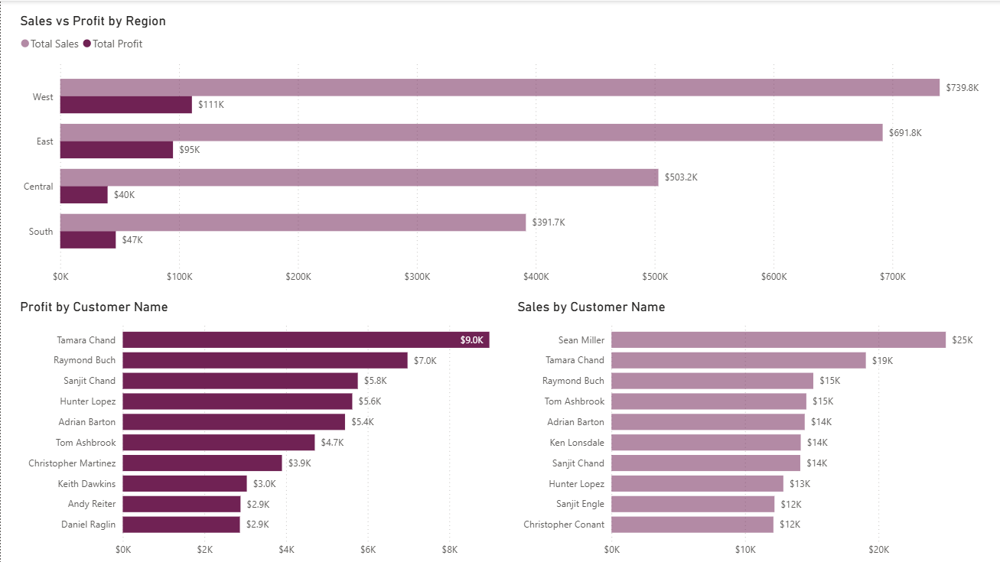

# 📊 E-commerce Sales Analytics Dashboard

## Overview

This project simulates a real-world business analytics engagement for **NovaCart**, a fictional mid-sized e-commerce retailer operating across the United States.

As the company's Data Analyst, the objective was to transform raw transactional sales data into meaningful business insights using **SQL** and **Power BI**. The project focuses on analyzing sales performance, profitability, customer purchasing behavior, product performance, regional trends, and the impact of discounting to support data-driven business decisions.

---

# 🏢 Business Scenario

NovaCart sells products across three major categories:

- Furniture
- Office Supplies
- Technology

Although the company has accumulated thousands of sales transactions over multiple years, management lacks a centralized reporting solution to monitor business performance.

The leadership team wants to answer critical business questions such as:

- Which product categories generate the highest revenue and profit?
- Which products should receive greater business investment?
- Which customers contribute the most value?
- Which regions perform best?
- How do discounts impact profitability?
- How has the business grown over time?

To address these challenges, an interactive analytics dashboard was developed using SQL and Power BI.

---

# 🎯 Project Objectives

- Analyze transactional sales data to evaluate business performance.
- Measure key business KPIs including Revenue, Profit, Orders, Customers, and Profit Margin.
- Identify top-performing products, categories, customers, and regions.
- Understand the relationship between discounts and profitability.
- Discover long-term sales trends.
- Deliver actionable business recommendations through interactive dashboards.

---

# 👥 Stakeholders

This dashboard is designed to support multiple business teams.

| Stakeholder | Business Need |
|-------------|---------------|
| Executive Leadership | Monitor overall business performance and profitability |
| Sales Managers | Identify top-selling products and sales trends |
| Regional Managers | Compare sales and profit across regions |
| Marketing Team | Analyze customer purchasing behavior and customer value |
| Finance Team | Evaluate profit margins and discount effectiveness |

---

# 📂 Dataset

- **Source:** Kaggle (Sample Superstore Dataset)
- **Records:** 10,194
- **Attributes:** 21
- **Time Period:** 2023–2026
- **Domain:** Retail / E-commerce

The dataset contains transactional information including:

- Orders
- Customers
- Products
- Categories
- Sales
- Profit
- Discounts
- Regions
- Order Dates

---

# 🛠 Tech Stack

### Data Analysis

- SQL

### Data Visualization

- Power BI

### Data Processing

- CSV
- Excel

---

# 📈 Dashboard Pages

## 1️⃣ Executive Summary

Provides a high-level overview of business performance through key performance indicators.

### KPIs

- Total Sales
- Total Profit
- Total Orders
- Total Customers
- Profit Margin

Additional visualizations include:

- Sales by Category
- Profit by Category
- Yearly Sales Trend

---

## 2️⃣ Product Performance Dashboard

Focuses on understanding product profitability and category performance.

Visualizations include:

- Profit by Sub-Category
- Discount vs Profit Analysis
- Top 10 Products by Sales

---

## 3️⃣ Customer & Regional Analysis

Analyzes customer purchasing behavior and geographical performance.

Visualizations include:

- Sales vs Profit by Region
- Top Customers by Sales
- Top Customers by Profit

---

# 🔍 Business Insights

### Sales Performance

- Technology generated the highest overall revenue.
- Sales showed consistent growth from 2024 onwards.
- Revenue exceeded **$2.3M** across the analysis period.

### Profitability

- Technology was the most profitable category.
- Furniture generated comparatively lower profits.
- Tables recorded negative profitability despite strong sales.

### Customer Analysis

- A small group of customers contributed significantly to total sales and profit.
- Customer purchasing behavior was uneven, indicating opportunities for loyalty programs.

### Regional Analysis

- The West region generated the highest revenue and profit.
- Central region lagged behind in overall profitability.

### Discount Analysis

- Higher discounts generally resulted in lower profit margins.
- Certain sub-categories experienced losses despite increased discounts.

---

# 💡 Business Recommendations

Based on the analysis, NovaCart should consider the following actions:

- Increase investment in high-performing Technology products.
- Reassess pricing and discount strategies for low-profit categories such as Furniture.
- Develop customer loyalty programs targeting high-value customers.
- Optimize inventory planning using yearly sales trends.
- Investigate underperforming regions to identify operational or marketing improvements.
- Implement discount policies that balance sales growth with profitability.

---

# 📌 Key Skills Demonstrated

- SQL Data Analysis
- Data Cleaning
- Business Intelligence
- KPI Reporting
- Dashboard Development
- Customer Segmentation
- Profitability Analysis
- Sales Analytics
- Data Visualization
- Business Storytelling
- Power BI
- Exploratory Data Analysis (EDA)

---

# 📷 Dashboard Preview

- Executive Dashboard
  


- Product Performance Dashboard



- Customer & Regional Dashboard



---

# 📁 Project Structure

```
Ecommerce-Sales-Analytics/
│
├── Dataset/
├── SQL/
│   ├── 01_Data_Exploration.sql
│   ├── 02_KPI_Analysis.sql
│   ├── 03_Category_Analysis.sql
│   ├── 04_Customer_Analysis.sql
│   ├── 05_Regional_Analysis.sql
│   ├── 06_Discount_Analysis.sql
│   └── 07_Time_Trend_Analysis.sql
│
├── PowerBI/
│   ├── Ecommerce Dashboard.pbix
│   └── Dashboard.pdf
│
├── Images/
└── README.md
```

---

# 🚀 Future Improvements

- Customer Lifetime Value (CLV) Analysis
- Sales Forecasting
- RFM Customer Segmentation
- Inventory Optimization
- Predictive Analytics using Machine Learning
- Interactive drill-through reports
